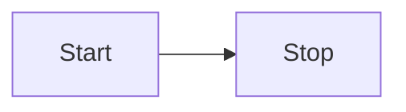

# mermaid code block



# mermaid image


# mermaid code block


```md
graph LR
    Start --> Stop
```


# mermaid link

* [Example](example.mmd "mermaid:")
* [Example](example.mmd "mermaid:")

# Lorem ipsum

Here is a paragraph with _some emphasis_ and some **strong text**, and a [link](http://google.com "title"). I ~~did~~ want to fix this.

```bash
$ npm i
```

* 
* 
